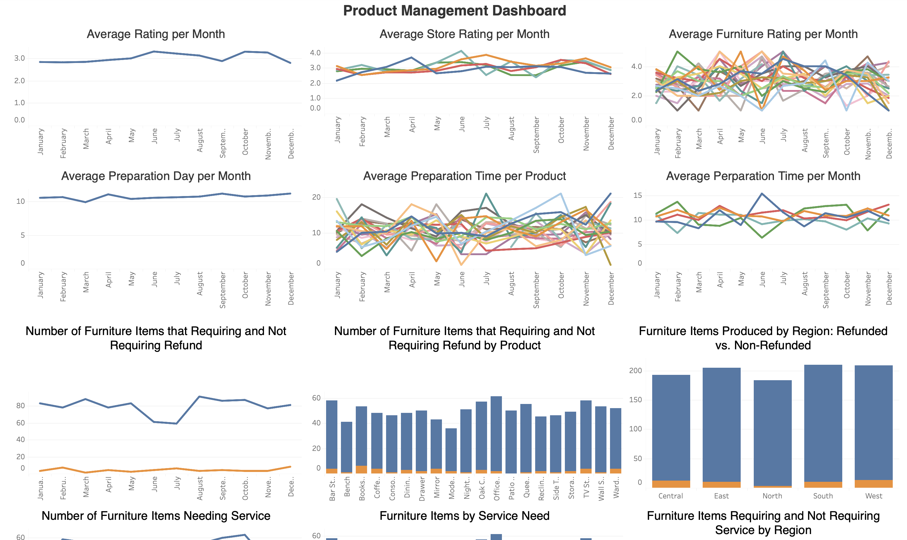

# Furniture Company Performance Analysis

### Dataset Explanation

#### Customers
Contains customer data.

**Columns:**
- `customer_id`,`customer_name`,`customer_phone_number`

#### Orders
Contains customer order data.

**Columns:**
- `order_id`,`customer_id`

#### Products
Contains product data.

**Columns:**
- `product_id`, `product_name`, `price`, `category`, `description`

#### Products_Orders
Contains customer order information and the products they ordered.

**Columns:**
- `product_id`, `order_id`, `service`, `refund`, `starting_date`, `finishing_date`,  `region`, `rating`
---

## Metrics

This Analysis aims to help the Head of Product and the Head of Sales at the furniture company examine their performance over the past few months. 

- Customer Rating
- Order Count
- Refund
- Service
- Production Time

The Dashboard aims to help the Head of Product at the furniture company examine their company product performance over the past few months. 
[See the dashboard](https://public.tableau.com/views/furniture_17833173956980/Dashboard2?:language=en-GB&:sid=&:redirect=auth&:display_count=n&:origin=viz_share_link)

---

## Insights

### Rating
  - According to the data, **207 orders** received a **5-star rating**, while **197 orders** received a **1-star rating**.
  - According to the data, the **North showroom** has **2 of the 4 lowest-rated products** based on average rating.
  - According to the data, the **Central showroom** has the **lowest average rating** among all showrooms, while the **West showroom** has the **highest average rating**.

### Item Sold
  - **Barstool** is one of the best-selling items in the **Central and West showrooms**.
  - **Console** is also one of the best-selling products in the **Central and East showrooms**.
  - **TV Stand** is one of the best-selling items in the **East and West showrooms**.
  - Dining Table is one of the best-selling items in the **East and South showrooms**.

### Least Favorite
  - Storage Cabinet is the least purchased item in the Central showroom,
  - followed by Coffee Table in the East showroom,
  - Mirror in the North showroom,
  - Dining Table in the South showroom,
  - and lastly Console in the West showroom.

### Number of Order
  - the South showroom has the highest number of orders in this dataset, while the North showroom has the lowest number of orders.
  - the East showroom performed the worst in one month (June),
  - the West showroom in three months (August, November, and December),
  - the Central showroom in one month (March),
  - the North showroom in five months (January, February, April, July, and October),
  - and the South showroom in three months (May, July, and September).
  - According to the data, the highest number of order is on August, followed by january, and october. The lowest number of order is on July

### Refund:
  - According to the data, almost every order that taken by all of our showrooms do not require refunds to customers. However, the **Central showroom** has the highest number of refunds compared to the other showrooms.

### Service:
  - top 3 product that need to be service that come from **Central showroom** are console, patio set, and moderns sofa
  - top 3 product that need to be service that come from **East showroom** are Storage Cabinet, TV Stand, Bar Stool
  - top 3 product that need to be service that come from **West showroom** are Queen Bed, Wall Shelf, BookShelf
  - top 3 product that need to be service that come from **South showroom** are Wardrobe, Office Desk, and Recliner
  - top 3 product that need to be service that come from **North showroom** are Coffee Table, Oak Chair, Nightstand

### Production Time:
  - According to the data, the Patio Set takes the longest time to produce on average in the **Central** (15 days), **East** (12 days), and **North (15 days) showrooms**.
  - Drawer is the second product that takes the longest time to produce on average in the **West** (14 days) and **North (14 days) showrooms**.

---
## Recomendations

### Rating:
- Develop an observation or survey with the product team for low-rated orders. Understand customers' concerns, pain points, and the shortcomings of those orders, then improve product and service quality based on the insights gathered.

### Least Favorite Item:
- Examine fewer demanding product, ask customer who have bought the product for a feedback about our product and service, and then built improved product tailor to customer need and preferences
- Conduct deep research to high-demanding product, examine their order, quality, marketing, and customer feedback. If applicable, applied implementable insight from high-demanding product to low-demanding product

### Number of Order:
- Examine the South Store's orders to understand its marketing campaigns, discounts, and available products. Take the insight to the North Store, and then applied applicable insight in South Store to North Store. And Further, rotate few employee on North Store to the South so they can learn and improved our North Store 

### Refund and Service:
- Examine all refunded or serviced order to accumulate the shortcoming of our product and service, after that gather Production team and Operational Team to discuss the best solution to improve and manage our product in the future

---
## Acknowledgements

- **Data:** Filled by ChatGPT
- **Tools Used:** Jupyter Notebook, SQLite, Tableau
